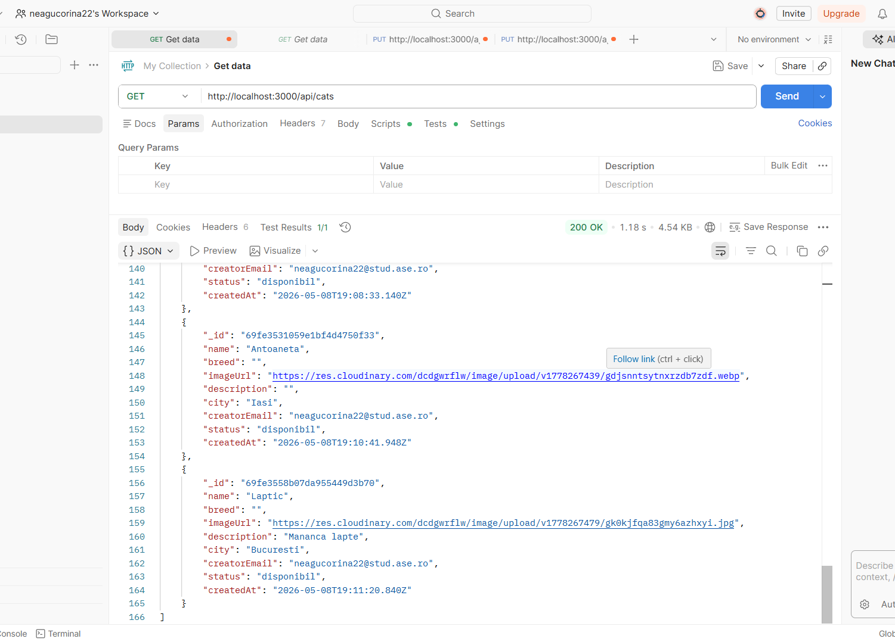
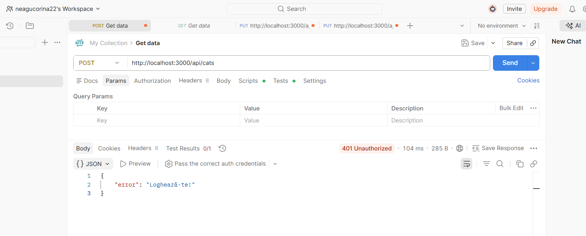
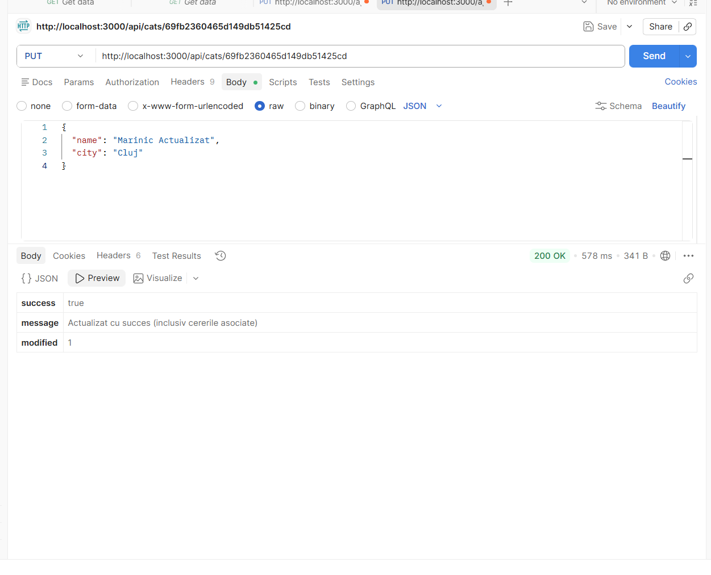
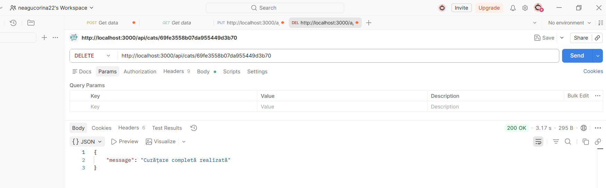

[Click aici pentru a vedea Documentatia Completa (PDF)](./Documentatie_CatAdopt.pdf)

**Student**: Neagu Corina-Maria
**Master**: SIMPRE
**Materie**: Cloud Computing
**Grupa**: 1146

| Resursa | Link |
| :--- | :--- |
| **Link Deploy Vercel** | https://cloud-computing-tan.vercel.app/ |
| **Link Video Youtube** | https://youtu.be/TQFzDPtqd_c |

# CatAdopt - Platformă Cloud-Native pentru Adoptii

## 1. Introducere
Tehnologiile **Cloud** au transformat modul în care interactionam cu mediile online, oferind atat scalabilitate, cat si accesibilitate globală. Proiectul **CatAdopt** reprezinta o platforma web dedicata facilitarii procesului de adoptie a animalelor, construita pe o arhitectură de tip **Cloud-Native**.

Obiectivul principal al acestui proiect este demonstrarea modului in care o suita de servicii Cloud pot fi integrate pentru a crea o solutie completa, sigura si eficienta. 

## 2. Descrierea Problemei
Procesul traditional de adoptie a animalelor se confrunta adesea cu:
* **Lipsa centralizarii:** Informatiile sunt fragmentate pe diverse retele sociale.
* **Dificultati in monitorizare:** Gestionarea manuala a cererilor de adoptie.
* **Comunicare ineficienta:** Intarzieri in raspunsurile dintre partile implicate.
* **Riscuri de securitate:** Expunerea datelor de contact personale.

### Solutia Propusa
Aplicatia abordeaza aceste probleme oferind un punct central de interactiune digitala unde:
1. **Status in timp real:** Fiecare pisica are un status vizibil (Disponibil/Adoptat).
2. **Management Automat:** Cererile sunt gestionate prin dashboard-ul utilizatorului.
3. **Notificari Instant:** Integrarea cu e-mail asigura o legatura rapida.
4. **Disponibilitate 24/7:** Infrastructura Cloud garanteaza accesibilitatea permanenta a serviciului.

> [!IMPORTANT]
> Aceasta abordare elimina necesitatea gestionarii unei infrastructuri fizice, utilizand un model **Serverless**, permitand dezvoltatorului sa se concentreze pe logica de business si pe experienta utilizatorului.

## 3. Arhitectura de Servicii Cloud

Proiectul adopta o strategie de tip **Multi-Cloud**, delegand responsabilitatile de infrastructura catre furnizori specializati. Acest model permite o disponibilitate ridicata si o mentenanta minima.

| Serviciu Cloud | Model | Descriere |
| :--- | :--- | :--- |
| **MongoDB Atlas** | PaaS (DBaaS) | Gazduirea bazei de date NoSQL in cluster distribuit global. |
| **Cloudinary** | SaaS | API pentru incarcarea, stocarea si redimensionarea automata a imaginilor. |
| **SendGrid** | SaaS | Infrastructura pentru livrarea e-mailurilor catre utilizatori. |
| **Google OAuth** | SaaS | Gestionarea securizata a identitatii si accesului utilizatorilor. |

## 4. Metode HTTP și Endpoint-uri API

Aplicația utilizează un set de rute API de tip **RESTful**, care permit interactiunea intre interfata de utilizator si serviciile Cloud (MongoDB, SendGrid).

| Metoda HTTP | Endpoint | Descriere | 
| :--- | :--- | :--- |
| **GET** | `/api/cats` | Preia lista tuturor pisicilor din MongoDB |
| **POST** | `/api/adoption` | Trimite o cerere de adoptie in baza de date | 
| **DELETE** | `/api/cats/[id]` | Sterge un anunt (permis doar proprietarului) |
| **POST** | `/api/send-email` | Declansează serviciul SendGrid pentru notificari | 
| **PATCH** | `/api/requests/[id]` | Modifica statusul unei cereri (Accepted/Rejected) | 
| **PUT** | `/api/cats/[id]` | Inlocuieste complet datele unui anunt existent | 

### 5. Exemple Request/Response prin intermediul Postman
### 5.1. Validare Functionalitate: Preluare Date (Read)
Mai jos este ilustrat un apel de tip **GET** catre endpoint-ul `/api/cats`. 

* **Status Code:** Se poate observa in partea de jos faptul ca serverul a returnat statusul `200 OK`.
* **Feedback Server:** contine obiectele **JSON** care stocheaza informatiile despre pisicile disponibile, preluate direct din clusterul MongoDB.

### 5.2. Validare Securitate: Testare Acces Neautorizat
Intrucat adaugarea unui anunt de adoptie trebuie permisa doar utilizatorilor autentificati, am efectuat un test de securitate prin trimiterea unei cereri de tip **POST** catre endpoint-ul `/api/cats` fara a furniza un token de sesiune valid.

* **Status Code:** `401 Unauthorized`
* **Mecanism de Protecție:** Serverul a interceptat cererea prin **middleware-ul de securitate**, refuzand procesarea acesteia.
* **Feedback Server:** Backend-ul returnează un obiect **JSON** care confirma identificarea lipsei sesiunii, demonstrand o gestionare corecta a accesului restricționat.

### 5.3. Validare Functionalitate: Actualizare Completa (Update)
Se observă utilizarea metodei **PUT** catre un endpoint-ul specific `PUT /api/cats/[id]` ce conține ID-ul unic al obiectului. Acest test confirma capacitatea sistemului de a modifica inregistrari existente in mod controlat.

* **Status Code:** `200 OK` 
* **Feedback Server:** Raspunsul JSON primit arata ca backend-ul nu doar modifica documentul in **MongoDB**, dar executa si logica adiacenta. Campul `modifiedCount: 1` din raspuns reprezinta dovada interactiunii cu baza de date, confirmand ca exact un document a fost identificat si actualizat cu succes in Cloud.

### 5.4. Validare Functionalitate: Stergere Anunt
Se observa procesul de testare pentru stergerea unei inregistrari specifice folosind ID-ul sau unic generat de **MongoDB Atlas**, utilizand ruta `/api/cats/[id]`.

* **Status Code:** `200 OK` si un mesaj de confirmare personalizat.
* **Feedback Server:** Acest test confirmă faptul ca aplicatia detine drepturile necesare de scriere/stergere in clusterul de baza de date si ca poate gestiona corect curatarea datelor din sistem.

